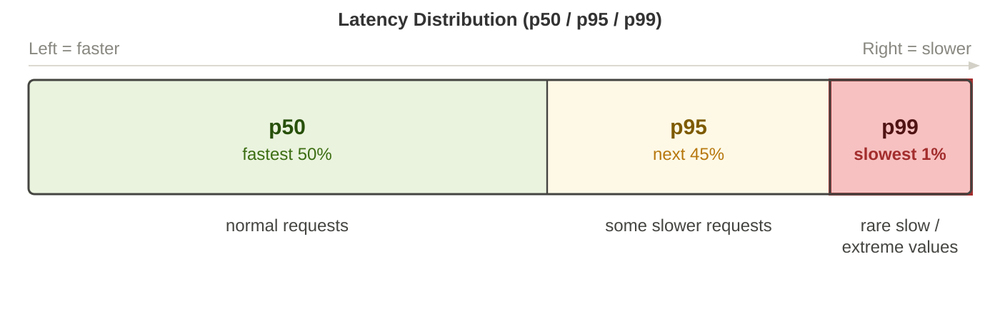
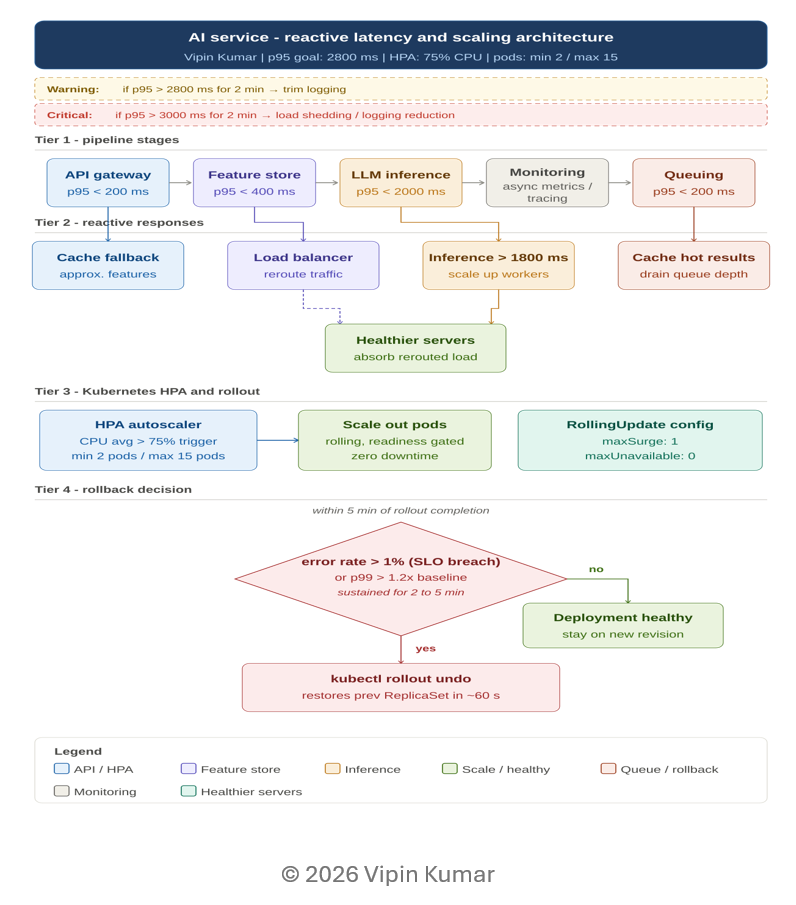

# AI Latency Budgeting & Reactive Scaling Framework
### A Production Performance Reference by **Vipin Kumar**

© 2026 Vipin Kumar. All rights reserved.

> **Technical Focus:** A production-grade blueprint for managing LLM inference latency budgets, establishing multi-tier scaling triggers, and implementing automated rollback logic based on p99 tail-latency behavior.

---

## 🚀 Overview

This repository presents a production-grade latency budgeting model and reactive scaling architecture for AI systems using **p50, p95, and p99 latency signals**.

It defines how to:
- Break down latency across pipeline stages
- Establish end-to-end SLOs
- Handle tail latency (p99)
- Trigger scaling and apply backpressure
- Safely rollback under degradation
- Optimize Infrastructure Costs: Prevent over-provisioning by using high-fidelity p99 signals to scale only when mathematically necessary.

---
## 📊 Latency Distribution (Concept)

  

---

## 🧠 Architecture Diagram

  

---

## 📊 Latency Model

### Pipeline Stages

| Stage | p50 | p95 | p99 |
|------|-----|-----|-----|
| Embedding | <100 ms | <200 ms | <400 ms |
| Retrieval | <200 ms | <400 ms | <800 ms |
| LLM Inference | <1000 ms | <2000 ms | <4000 ms |

### End-to-End Targets

- **Base p95:** 2600 ms
- **With overhead:** ~2800 ms
- **p99:** ~5200 ms

---

## ⚡ Key Concepts

- **p95 ≈ 2× p50** → normal variance
- **p99 ≈ 2× p95** → tail amplification
- **LLM dominates (~70–80%) latency**
- **Percentiles do not compose linearly**

---

## 🔄 Reactive Scaling Strategy

### Thresholds

| Condition | Action |
|----------|--------|
| p95 > 1800 ms | Scale up workers |
| p95 > 2800 ms (2 min) | Trim logging |
| p95 > 3000 ms (2 min) | Load shedding |

---

## 🛡️ Stability & Recovery

### Backpressure
- Rate limiting
- Load shedding
- Logging reduction

### Rollback Logic
- Error rate > 1%
- OR p99 > 1.2× baseline (2–5 min sustained)

---

## ⚙️ Execution Model

- **Sequential:**  
  `total = sum(stages) + overhead`

- **Parallel:**  
  `total = max(stage) + overhead`

---

## 🧪 Environment Strategy

| Stage | Metric Focus |
|------|-------------|
| DEV | p50 |
| QA / SIT | p95 |
| UAT / STG | p95 + p99 |
| PRD | p99 |

---

## 🎯 Key Takeaways

- Design around **p95 (SLO)**
- Monitor **p99 (instability signal)**
- Scale **before breach (≈90% threshold)**
- Optimize **LLM first**
- Protect system with **backpressure + rollback**

---

## 📄 Full Document

Refer to the detailed document:
